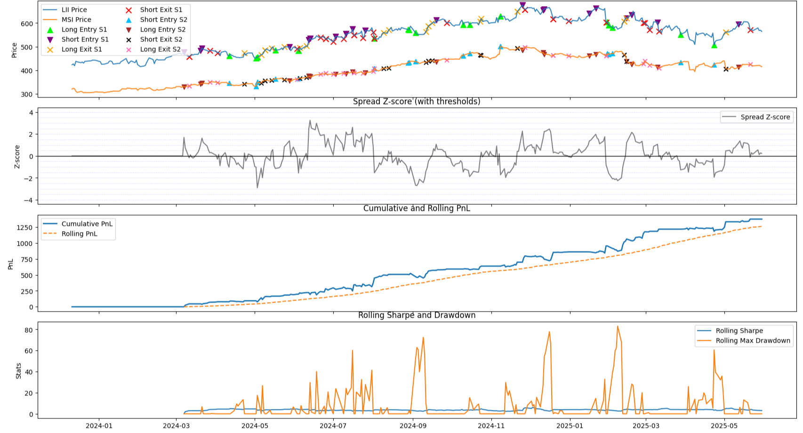

---
title: "Cameron Hayman"
format: html
---

  "Building systematic trading systems at the intersection of research and execution."

---

## Areas of Focus

::: {.columns}
::: {.column width="50%"}
- **Statistical Arbitrage**  
  Multi-leg, mean-reverting, market-neutral strategies
- **Machine Learning & Alpha**  
  Predictive modeling, feature engineering, risk analytics
:::
::: {.column width="50%"}
- **Real-Time Execution Systems**  
  Automated infra, backtesting, live dashboards
- **Alternative Data & NLP**  
  Sentiment, event-driven pipelines, unstructured data
:::
:::

---

  

  <em>**LII-MSI Pairing:** Multi-leg, laddered, stat-arb strat: *PnL: 1375.99, Sharpe: 3.29; Rolling: 3.09, Total Trades: 104.*</em>

---

## About

Quantitative Researcher specializing in **designing, validating, and deploying production-grade trading strategies**.  
Passionate about bridging the gap between rigorous research and real-world trading performance.

---

## Connect

Explore my featured projects, detailed backtests, and open-source code.  
Feel free to connect!

