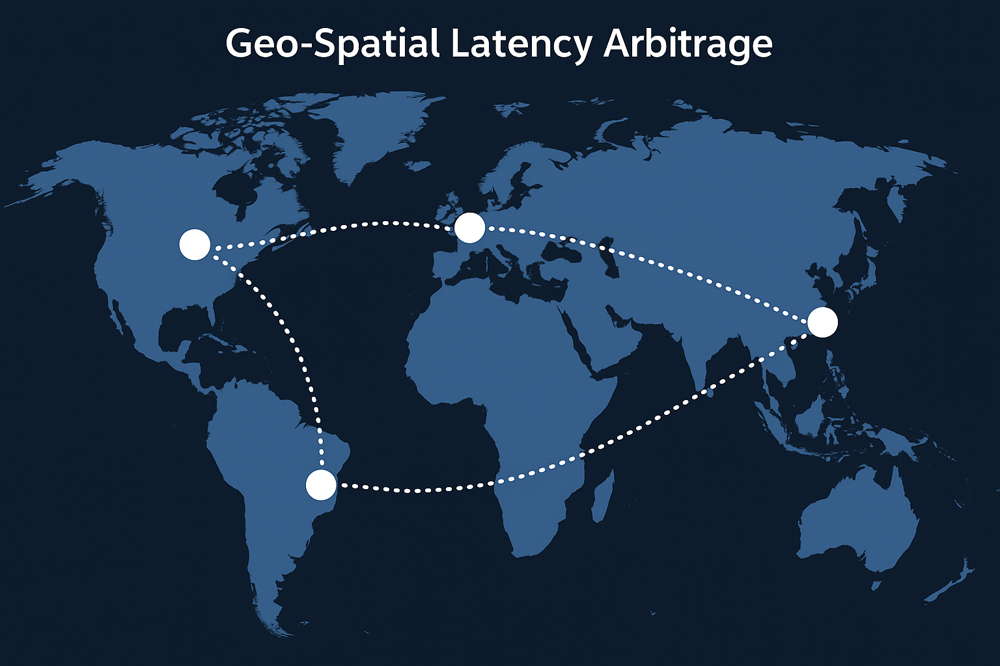
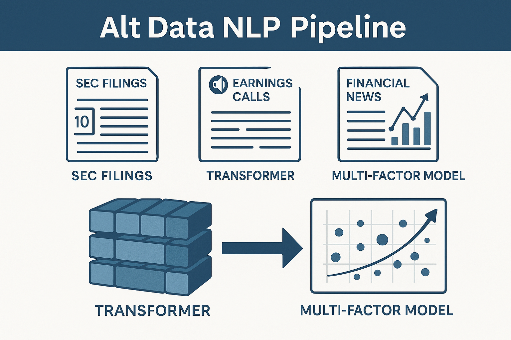
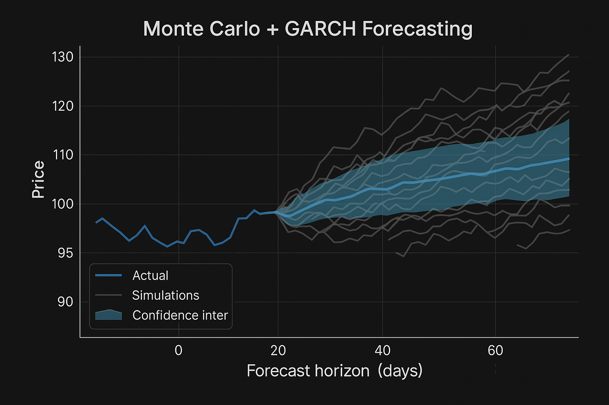

## Statistical Arbitrage Systems

  
   
  <a href="https://github.com/chayman7771/stat-arb-desk" target="_blank" class="gh-badge">
     View Code
  </a>

  <em>
    Full-stack execution system deploying real-time mean reversion and momentum strategies using Python, R, and SQL.
  </em>

---

## Geo-Spatial Latency Arbitrage

  
   
  <a href="https://github.com/chayman7771/global-latency-arb" target="_blank" class="gh-badge">
     View Code
  </a>

  <em>
  Optimizes cross-market spreads with real-time rerouting using Prometheus, PowerShell, and Grafana.
  </em>

---

## Alternative Data Processing Methods

  
   
  <a href="https://github.com/chayman7771/nlp-pipeline" target="_blank" class="gh-badge">
     View Code
  </a>

  <em>
    Extracts alpha from 10-Qs, earnings calls, and filings using transformer models and integrates them into multifactor engines.
  </em>

---

## Monte Carlo, GARCH, ARIMA & Other Forecasting Models

  
   
  <a href="https://github.com/chayman7771/garch-forecasting" target="_blank" class="gh-badge">
     View Code
  </a>

  <em>
    Equity price prediction engine combining time-series simulation and stochastic volatility models (R, ggplot2).
  </em>

